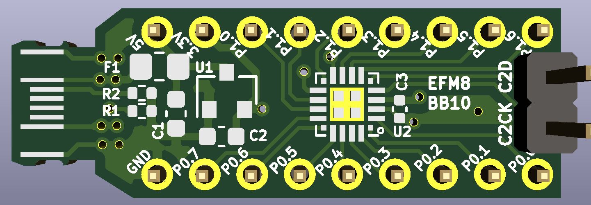
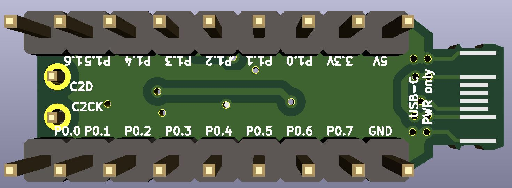

# EFM8 Bug board

Small breakout board, to comfortably use EFM8BB01F8G. 
To be fabbed in 0.6 or 0.8 mm

Layout stronly inspired by [osafune](http://osafune.github.io/efm8ub1_breakout.html)
USB-C PCB connector courtesy of [rabid-inventor](https://github.com/rabid-inventor/USBC_PCB_Socket_Adaptor)
